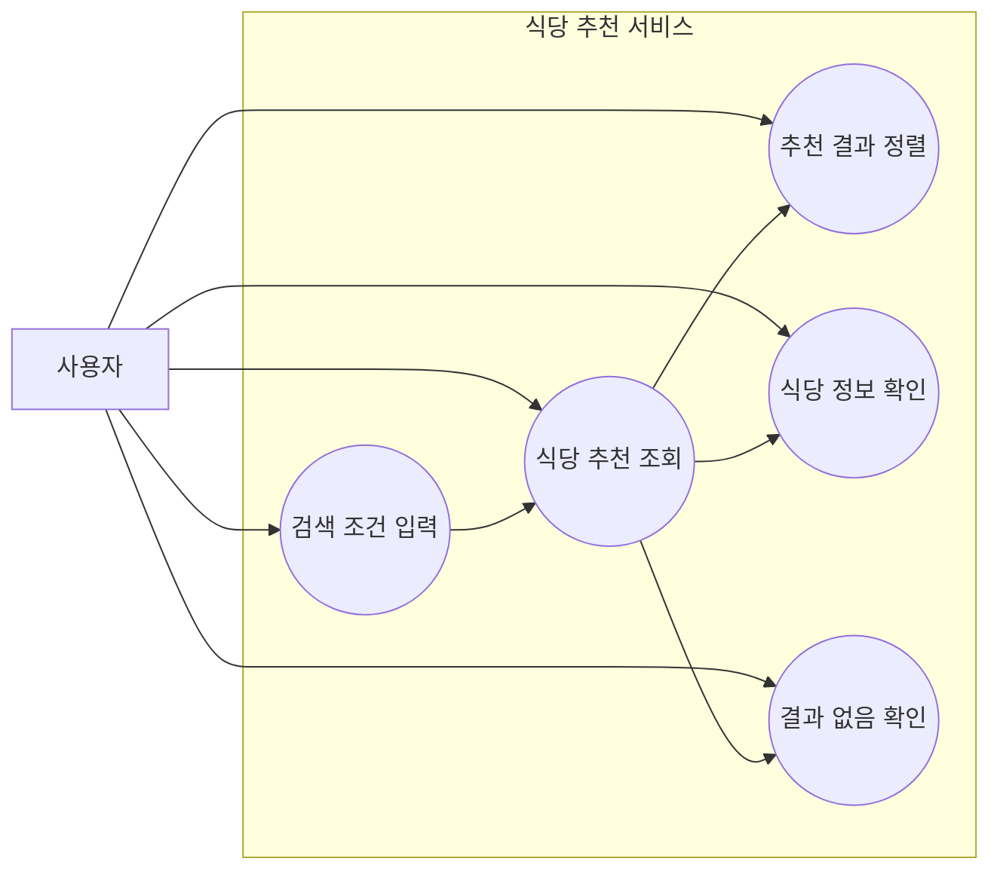

# 설계 문서

## 1. 기술 스택

본 프로젝트는 React + Vite 기반의 프론트엔드 중심 구조로 개발한다.

| 구분 | 내용 |
|---|---|
| Frontend | React + Vite |
| Language | JavaScript |
| Data | restaurants.json |
| Style | CSS |
| Test | 추천 로직 함수 단위 테스트 |
| Version Control | GitHub |

별도의 백엔드 서버나 데이터베이스는 사용하지 않고, `restaurants.json` 파일에 저장된 식당 데이터를 사용한다.

---

## 2. 유스케이스

유스케이스는 최종 MVP의 핵심 기능 기준으로 정의한다.

| ID | 유스케이스 | 설명 |
|---|---|---|
| UC-01 | 검색 조건 입력 | 사용자가 예산, 음식 카테고리, 가까운 역, 식사 목적을 입력한다. |
| UC-02 | 식당 추천 조회 | 시스템이 조건에 맞는 식당 목록과 추천 이유를 보여준다. |
| UC-03 | 추천 결과 정렬 | 사용자가 추천 결과를 가까운 순, 높은 가격순, 낮은 가격순으로 정렬한다. |
| UC-04 | 식당 정보 확인 | 사용자가 추천된 식당의 메뉴, 가격대, 위치 정보를 확인한다. |
| UC-05 | 결과 없음 확인 | 조건에 맞는 식당이 없을 때 안내 문구를 확인한다. |

---

## 3. 유스케이스 다이어그램



전체 구조 다이어그램


---

## 4. 기본 사용 흐름

1. 사용자가 메인 화면에 접속한다.
2. 사용자가 예산, 음식 카테고리, 가까운 역, 식사 목적 중 원하는 조건을 입력한다.
3. 음식 카테고리 중 아시안 또는 기타를 선택한 경우 세부 카테고리를 선택할 수 있다.
4. 사용자가 추천 버튼을 누른다.
5. 시스템은 `restaurants.json` 데이터를 불러온다.
6. 시스템은 입력 조건에 맞는 식당을 필터링한다.
7. 시스템은 추천 이유를 포함한 결과를 화면에 보여준다.
8. 사용자는 추천 결과를 가까운 순, 높은 가격순, 낮은 가격순으로 정렬할 수 있다.
9. 조건에 맞는 식당이 없으면 결과 없음 안내 문구를 보여준다.

---

## 5. 데이터 구조

식당 데이터는 다음과 같은 형식으로 관리한다.

```json
 {
    "id": 1,
    "name": "홍대분식",
    "district": "마포구",
    "dong": "서교동",
    "nearStation": "홍대입구",
    "distanceFromStation": 117,
    "address": "서울특별시 마포구 서교동 …",
    "category": "한식",
    "menus": [
      {
        "name": "할머니 손맛 떡볶이",
        "price": 5000
      },
      {
        "name": "수제 모둠 튀김 세트",
        "price": 11000
      }
    ],
    "priceRange": "5000-10000",
    "purposes": [
      "혼밥",
      "직장점심",
      "친구모임"
    ]
  }
```
## 6. 와이어프레임

